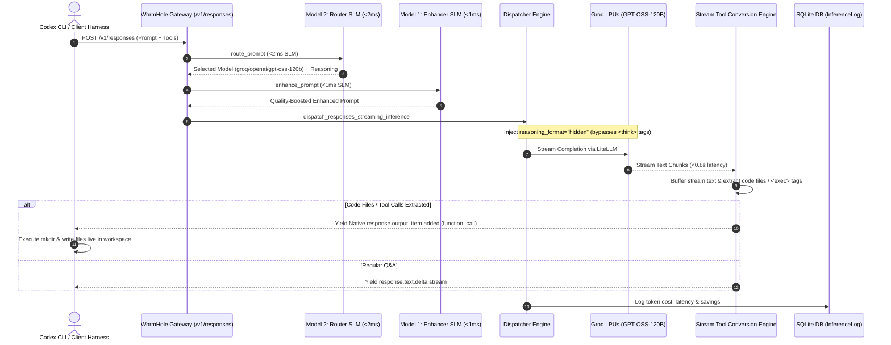
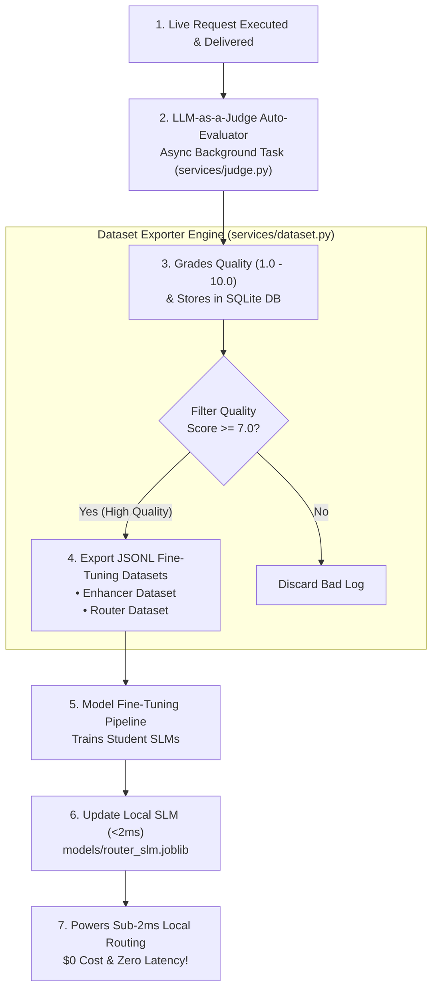

# WormHole — System Architecture & Workflow Specifications

This document outlines the detailed architectural breakdown and flow mechanics of the **WormHole AI Inference Cost Reducer**.

---

## 🎨 System Flow Diagram (Codex CLI & Agentic Harness Execution Flow)



---

## 📊 Intermediate Layer Components

### 1. Model 1 (Prompt Enhancer)
- **Role**: Transforms raw, terse, or poorly structured input prompts into detailed, highly explicit, edge-case-aware instructions.
- **Why**: Allows low-cost, mid-tier models (such as `gpt-4o-mini`, `gemini-1.5-flash`, `claude-3-haiku`) to execute tasks with the accuracy and depth of high-cost frontier models.

### 2. Model 2 (Router LLM)
- **Role**: An intermediate decision LLM that takes the enhanced prompt, compares its required reasoning complexity against registered enterprise model specs, and selects the lowest-cost model that can fulfill the request.
- **Output Schema**:
  ```json
  {
    "selected_model": "gpt-4o-mini",
    "reasoning": "The prompt asks for simple code formatting, which gpt-4o-mini executes accurately at 1/15th the cost of gpt-4o."
  }
  ```

### 3. Auto-Evaluator (LLM-as-a-Judge)
- **Role**: Asynchronously grades completion quality against the enhanced prompt on a 1.0 - 10.0 scale.
- **File**: [`services/judge.py`](file:///Users/venkat/Documents/AI/WormHole/services/judge.py)
- **Feedback Loop**: High-scoring completions (`judge_score >= 7.0`) are persisted to build fine-tuning datasets for training custom student models.

### 4. Dataset Generator & SLM Fine-Tuning Engine
- **Role**: Exports formatted JSONL training datasets from historical high-scoring inferences.
- **File**: [`services/dataset.py`](file:///Users/venkat/Documents/AI/WormHole/services/dataset.py)
- **Continuous Learning Loop**:



---

## 💾 Database Schema (`InferenceLog`)

| Column | Type | Description |
|---|---|---|
| `id` | Integer (PK) | Primary log record ID |
| `request_id` | String | Unique request correlation UUID (`wh-...`) |
| `created_at` | DateTime | Timestamp of inference request |
| `original_prompt` | Text | Raw prompt received from client |
| `enhanced_prompt` | Text | Prompt generated by Model 1 |
| `enhancer_model` | String | Model used for enhancement |
| `router_model` | String | Model used for routing decision |
| `router_reasoning` | Text | Model 2 justification for model choice |
| `selected_model` | String | Target model dispatched |
| `baseline_model` | String | Comparison baseline model (`gpt-4o`) |
| `completion` | Text | Output text returned to client |
| `prompt_tokens` | Integer | Number of input tokens |
| `completion_tokens` | Integer | Number of output tokens |
| `total_tokens` | Integer | Total tokens processed |
| `actual_cost` | Float | Calculated API cost in USD |
| `baseline_cost` | Float | Cost if routed to `gpt-4o` in USD |
| `cost_savings` | Float | Dollar savings (`baseline_cost - actual_cost`) |
| `latency_ms` | Float | Total response latency in milliseconds |
| `judge_score` | Float | Auto-evaluator quality score (1.0 - 10.0) |
| `judge_feedback` | Text | Judge evaluation notes |
