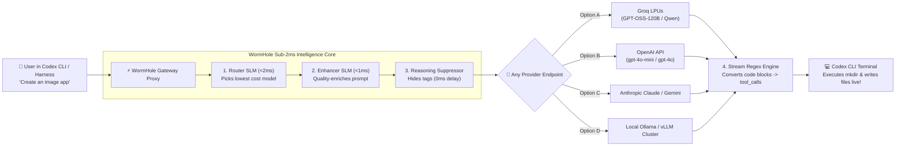
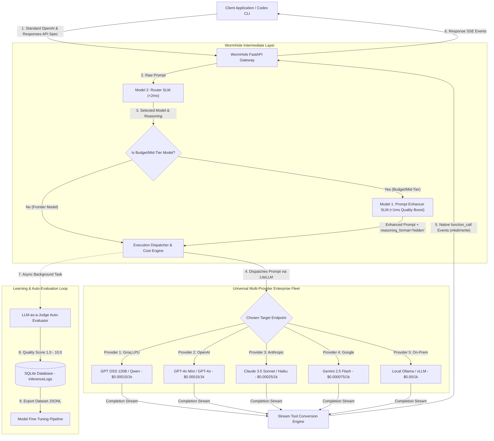
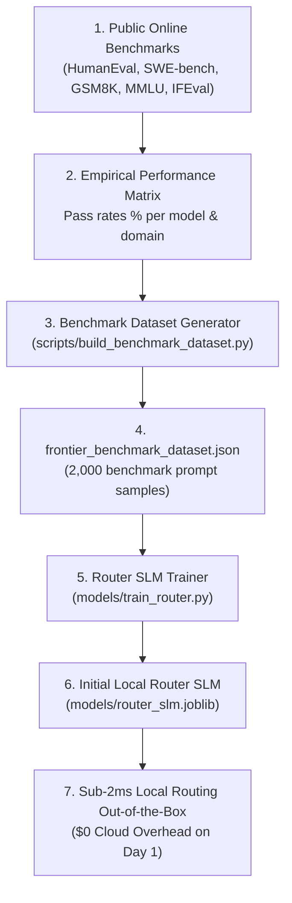
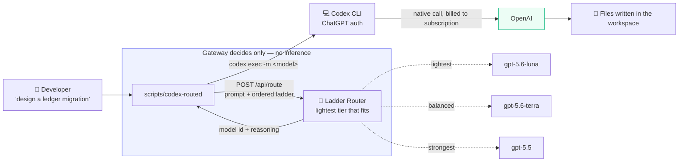
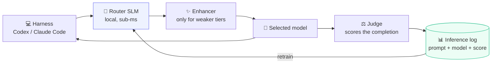

# WormHole — Enterprise AI Inference Cost Reducer

**WormHole** is a **100% Provider-Agnostic** enterprise AI inference middleware layer designed to drastically reduce LLM API spend while preserving or elevating completion quality. 

> 🔌 **Universal Multi-Provider Support**: WormHole acts as a drop-in proxy for **ANY downstream LLM provider or custom endpoint**—including **Groq LPUs**, **OpenAI**, **Anthropic Claude**, **Google Gemini**, **Local Ollama**, or **Self-Hosted vLLM / TGI Clusters**.


A short recording of one real routed run is at
[docs/wormhole_terminal_demo.mp4](docs/wormhole_terminal_demo.mp4). Every figure
in it is read from `data/demo_capture.json`, written by an actual request
through the gateway, and regenerated with `python scripts/record_terminal_demo.py`.
If a run routes somewhere unexpected or scores badly, the video shows that.

> **Project status and scope.** This is a working single-developer project, not a
> hardened product. Provider support is real but depends on your own keys: the
> routing fleet is defined in `config.py`, and any model whose provider has no
> credentials configured is excluded from routing automatically. Development and
> testing to date have been against **Groq** and **local Ollama**.
>
> **Measured result.** Across 521 requests logged during development, the models
> actually selected cost **$0.13** for 124,563 input / 176,688 output tokens,
> against **$2.08** for those same measured token counts at GPT-4o rates — a
> **93.6% reduction**. Reproduce it on your own data with
> `python scripts/measure_savings.py`. The token counts and model choices are
> real; the GPT-4o baseline is a counterfactual, and this sample is one
> developer's traffic, not a claim about any other workload.
>
> **Quality is not measured.** There is no benchmark in this repository, and the
> LLM-as-judge scores collected so far are not trustworthy: the judge stored a
> hardcoded 8.5 whenever its call failed, and it was pinned to a model the
> provider had decommissioned, so 152 of 238 stored scores are placeholders
> rather than evaluations. Excluding them leaves 4.38/10 over 86 rows, and that
> remainder is not reliable either. Judge failures now store no score at all;
> a trustworthy figure requires traffic recorded after that fix. Any claim about
> output quality is currently unsupported.
>
> **How "cost savings" is calculated.** The savings figure in the dashboard is a
> *computed counterfactual*, not measured spend. For each request the gateway
> prices the tokens actually used against the model that served them, then prices
> the same token counts against a GPT-4o baseline using the static rates in
> `config.py`, and reports the difference. It does not observe your real invoices,
> and it does not account for retries, failovers, or per-provider billing rules.
> Treat it as an estimate of routing benefit under a fixed price table.

It introduces a dual-model intermediate layer between your client application harness and downstream LLM providers:
1. **Prompt Enhancer (Model 1)**: Quality-enriches and structures the user prompt so smaller, cheaper models achieve frontier-quality output.
2. **Router Model (Model 2)**: Evaluates the enhanced prompt against registered enterprise models and dynamically routes it to the lowest-cost model capable of handling the task.

---

## ⚡ 60-Second Explanation (How to Explain to a Friend)

> **Think of WormHole like a Smart Gateway for AI Coding Agents.**
> When you ask Codex CLI to *"Create an app"* or *"Fix a bug"*, instead of sending that request directly to expensive $0.03/req models (like GPT-4o), WormHole intercepts it:
> 1. **<2ms Router**: Picks the absolute fastest, cheapest target model (Groq LPUs, OpenAI mini, local Ollama, or custom endpoints).
> 2. **<1ms Enhancer**: Enriches your prompt with explicit context so cheap models behave like frontier models.
> 3. **0ms Reasoning Suppressor**: Bypasses slow `<think>` tags so completions stream instantly in <1s.
> 4. **Stream Tool Engine**: Automatically turns code output into native terminal commands (`exec`, `mkdir`, `cat << 'EOF' > file`) so Codex CLI creates files live in your workspace.



---

## 🏗️ Architecture & System Flow



---

## 🔄 Step-by-Step Processing Pipeline

### 1. Request Ingestion (`/v1/responses` & `/v1/chat/completions`)
Client applications send standard OpenAI-formatted completion payloads. WormHole acts as a drop-in replacement proxy for Codex CLI and web apps.

### 2. Router Decision (Model 2 Local SLM)
- **File**: [`services/router.py`](file:///Users/venkat/Documents/AI/WormHole/services/router.py)
- Evaluates raw prompt complexity in **< 2 milliseconds** against registered enterprise models and benchmark capability profiles.

### 3. Selective Prompt Enhancement (Model 1 Local SLM)
- **File**: [`services/enhancer.py`](file:///Users/venkat/Documents/AI/WormHole/services/enhancer.py)
- **If a Frontier Model is selected** (`gpt-4o`, `claude-3-5-sonnet`): Prompt enhancement is **bypassed** to save unnecessary latency and token overhead.
- **If a Budget/Mid-Tier Model is selected** (`groq/openai/gpt-oss-120b`, `groq/qwen/qwen3.6-27b`): Model 1 quality-enriches the prompt in **< 1 millisecond** so the budget model outputs frontier-level completions.

### 4. Reasoning Suppression (`reasoning_format="hidden"`)
- **File**: [`services/dispatcher.py`](file:///Users/venkat/Documents/AI/WormHole/services/dispatcher.py)
- Bypasses internal reasoning/thinking tags (`<think> ... </think>`) on Groq LPUs, eliminating 12s+ token delays and streaming output code blocks immediately from Token #1.

### 5. Stream Tool Conversion Engine
- **File**: [`services/dispatcher.py`](file:///Users/venkat/Documents/AI/WormHole/services/dispatcher.py)
- Intercepts streaming code blocks (`# app.py`, `<!-- templates/index.html -->`, `<exec>`) and converts them in real time into native OpenAI Responses API `function_call` events (`exec`, `mkdir`, `cat << 'EOF' > file`).
- Codex CLI receives native execution events and creates files live in your workspace.

### 6. Asynchronous Auto-Evaluation (LLM-as-a-Judge)
- **File**: [`services/judge.py`](file:///Users/venkat/Documents/AI/WormHole/services/judge.py)
- Asynchronously grades completion quality on a scale of **1.0 to 10.0**.
- Persists judge score, feedback, latency, and costs to SQLite database.

### 8. How Local SLMs are Trained and Retrained

WormHole uses dedicated training pipelines in [`models/`](file:///Users/venkat/Documents/AI/WormHole/models) to train and continuously retrain lightweight local SLMs from high-scoring historical completions (`judge_score >= 7.0`):

1. **Router SLM Training (`models/train_router.py`)**:
   - **Architecture**: N-gram TF-IDF Vectorizer + Gradient Boosting Classifier (or PyTorch/DistilBERT).
   - **Training Data**: High-scoring historical prompts mapped to their optimal `selected_model`.
   - **Inference Latency**: **< 2 milliseconds** (saved to [`models/router_slm.joblib`](file:///Users/venkat/Documents/AI/WormHole/models/router_slm.joblib)).
   - **Retraining Command**: `.venv/bin/python models/train_router.py`

2. **Enhancer SLM Training (`models/train_enhancer.py`)**:
   - **Architecture**: Cosine Nearest-Neighbors TF-IDF Vectorizer / Local LoRA Student SLM.
   - **Training Data**: Terse raw prompts mapped to high-scoring enhanced completions.
   - **Inference Latency**: **< 1 millisecond** (saved to [`models/enhancer_slm.joblib`](file:///Users/venkat/Documents/AI/WormHole/models/enhancer_slm.joblib)).
   - **Retraining Command**: `.venv/bin/python models/train_enhancer.py`

### 9. Bootstrapping SLMs with Public Online Benchmarks

Before live traffic is processed, WormHole's Router SLM is bootstrapped and pretrained on empirical performance profiles from public online AI benchmarks ([`scripts/build_benchmark_dataset.py`](file:///Users/venkat/Documents/AI/WormHole/scripts/build_benchmark_dataset.py)):

- **Benchmarks Integrated**: `HumanEval`, `MBPP` (Simple Code), `SWE-bench`, `LiveCodeBench` (Complex Software Architecture), `GSM8K`, `MATH` (Math Reasoning), `GPQA`, `MMLU` (Graduate Knowledge), and `IFEval` (Strict Formatting).
- **Optimization Strategy**: 
  - Filter candidate models achieving **$\ge 75\%$ pass rate** on the specific task domain.
  - Select the model with the **lowest input/output token cost**.
- **Cold-Start Deployment**: Enables sub-2ms local SLM routing with 0 cloud API overhead out-of-the-box on Day 1.



---

## 💰 Candidate Models & Cost Accounting

| Model ID | Provider | Input Cost / 1k | Output Cost / 1k | Intelligence Tier | Typical Speed |
|---|---|---|---|---|---|
| `groq/openai/gpt-oss-120b` | Groq LPU | $0.00015 | $0.00060 | Frontier | Ultra Fast (<0.8s) |
| `groq/openai/gpt-oss-20b` | Groq LPU | $0.00075 | $0.00030 | High | Ultra Fast (<0.5s) |
| `groq/qwen/qwen3.6-27b` | Groq LPU | $0.00010 | $0.00040 | High | Fast (<1.0s) |
| `gpt-4o-mini` | OpenAI | $0.00015 | $0.00060 | Medium | Fast |
| `gpt-4o` | OpenAI | $0.00250 | $0.01000 | Frontier | Medium |

Rates are those configured in `config.py` and are used for the cost estimate
described above; verify them against current provider pricing before relying on
the numbers. The full fleet also includes `ollama/qwen2.5-coder:7b` (local, $0),
`gemini/gemini-2.5-flash`, `gemini/gemini-2.5-pro` and `claude-3-haiku`.

### A note on the model names Codex sees

`/v1/models` advertises names such as `gpt-5.6`, `gpt-5.5` and `gpt-4.5`. These
are **compatibility aliases, not upstream models**, and WormHole makes no claim
that such models exist. Codex CLI selects a default model by a compiled-in name
and refuses to start if the catalog does not list it, so the gateway accepts
those names and routes each one through the local router to a real model in the
fleet. See `services/codex_models.py`.

---

## ⚔️ Competitive Analysis & Differentiation

For detailed feature comparison matrices, technological moats, and enterprise TCO breakdowns versus OpenRouter, Portkey, RouteLLM, Martian, and LiteLLM Enterprise, see **[COMPETITIVE_ANALYSIS.md](COMPETITIVE_ANALYSIS.md)**.

### Summary Comparison Matrix:

| Feature | ⚡ **WormHole** | 🔌 **OpenRouter** | 🔑 **Portkey** | 🔬 **RouteLLM** |
|---|---|---|---|---|
| **Model 1: Prompt Enhancer** | **Yes (Local SLM <1ms)** | ❌ No | ❌ No | ❌ No |
| **Model 2: Router Engine** | **Yes (Local SLM <2ms, $0 Cost)** | Static user lists | Rule-based configs | Matrix router |
| **Auto-Judge Feedback** | **Yes (1.0-10.0 scale)** | ❌ No | ❌ No | ❌ No |
| **Fine-Tuning Flywheel** | **Yes (JSONL Export & `/api/router/retrain`)** | ❌ No | ❌ No | ❌ No |
| **Deployment Model** | **100% Private VPC / Self-Hosted** | Third-party Cloud SaaS | Cloud / Self-Hosted | Open Source |

---

## 🛠️ Custom AI Harness Integration (Claude Code, Cursor, Codex, Aider)

WormHole acts as a seamless drop-in replacement proxy for all custom developer coding harnesses and AI tools. For complete step-by-step setup guides, see **[HARNESS_INTEGRATION_GUIDE.md](HARNESS_INTEGRATION_GUIDE.md)**.

- **Claude Code CLI**: `export ANTHROPIC_BASE_URL="http://127.0.0.1:8000"` (no `/v1` suffix — the client appends `/v1/messages` itself)
- **Cursor IDE / VS Code**: Set `OpenAI Base URL` to `http://127.0.0.1:8000/v1`
- **Aider CLI / Continue.dev**: Point API base to `http://127.0.0.1:8000/v1`

---

## 🔌 API Endpoints & Interfaces

### 1. OpenAI-Compatible Chat Proxy
```http
POST /v1/chat/completions
Content-Type: application/json

{
  "model": "wormhole-auto",
  "messages": [
    { "role": "user", "content": "Write a Python function to check if a string is a palindrome." }
  ]
}
```

### 2. Analytics & Historical Logs
```http
GET /api/logs
```
Returns summary metrics (total requests, total cost spent, total baseline cost, net savings $, net savings %, average judge score) and recent inference logs.

### 3. Registered Candidate Models
```http
GET /api/models
```

### 4. Fine-Tuning Dataset Export
```http
GET /api/dataset/export?target=router
GET /api/dataset/export?target=enhancer
```

### 5. Enterprise Web Dashboard
Access **`http://127.0.0.1:8000/`** in your browser for a live graphical analytics dashboard.

---

## ⚡ Quickstart & Local Execution

```bash
# Clone & Navigate to Repository
cd /Users/venkat/Documents/AI/WormHole

# Activate Virtual Environment
source .venv/bin/activate

# Install Dependencies
pip install -r requirements.txt

# Run Automated Test Suite
PYTHONPATH=. pytest

# Start Gateway Server
uvicorn main:app --host 127.0.0.1 --port 8000
```

---

## 📁 Repository Structure

```
WormHole/
├── config.py             # System configuration, API keys, & candidate model definitions
├── db/
│   ├── database.py       # SQLModel engine & session setup
│   └── models.py         # InferenceLog schema (prompts, costs, judge scores)
├── services/
│   ├── enhancer.py       # Model 1: Quality Prompt Enhancer Service
│   ├── router.py         # Model 2: Router LLM Decision Service
│   ├── judge.py          # LLM-as-a-Judge Auto-Evaluation Service
│   ├── dispatcher.py     # Execution Dispatcher & Real-time Cost Calculation Engine
│   └── dataset.py        # Fine-Tuning JSONL Dataset Exporter
├── tests/
│   ├── test_api.py       # API proxy & analytics endpoint unit tests
│   └── test_components.py # Unit tests for enhancer, router, dispatcher, judge, & exporter
├── main.py               # FastAPI application host, proxy, & Web Dashboard UI
└── requirements.txt      # Python dependencies
```

---

## 📄 License

Licensed under the Apache License 2.0. See [LICENSE](LICENSE).

## 🔐 Configuration & Secrets

Copy [`.env.example`](.env.example) to `.env` and fill in only the providers you
intend to use. `.env` is gitignored and must never be committed.

Gateway authentication is off by default for local use. Setting `ENABLE_AUTH=true`
requires at least one key in `WORMHOLE_API_KEYS` (comma-separated); the gateway
refuses all requests rather than falling back to a default, so an endpoint you
believe is protected cannot silently be open.

## 🤝 Contributing

Issues and pull requests are welcome. Please run the test suite before opening a PR:

```bash
pytest tests/ -q
```

---

## 🎯 Single-Vendor Routing (e.g. stay inside OpenAI)

A common enterprise policy is not "switch vendors" but "stop defaulting to the
flagship for routine work". `ROUTING_PROVIDERS` restricts routing to one vendor
while still selecting the cheapest capable tier within it:

```bash
export ROUTING_PROVIDERS=openai   # only OpenAI models are eligible
export ROUTER_MODE=llm            # semantic routing; see the note below
python scripts/build_benchmark_dataset.py   # retrain within the restricted fleet
python models/train_router.py
```

The allowlist applies to training as well as request time. The local classifier
can only emit labels it saw in training, so restricting the fleet at runtime
alone would leave it predicting models it may no longer pick, and falling back
to a single default every time.

Observed decisions with `ROUTING_PROVIDERS=openai` and `ROUTER_MODE=llm`:

| Prompt | Routed to |
|---|---|
| `print hello world in python` | `gpt-4o-mini` |
| `what is the capital of France` | `gpt-4o-mini` |
| `summarise this paragraph in one line` | `gpt-4o-mini` |
| `design a sharded write-ahead log ... prove durability` | `gpt-4o` |
| `optimise this algorithm to O(n log n) and prove correctness` | `gpt-4o` |
| `refactor payment reconciliation to be idempotent` | `gpt-4o` |

### Which router to use

`ROUTER_MODE=slm` is sub-millisecond but is bag-of-words over synthetic
templates. It matches training phrasing well and **does not generalise**: on
unseen wording it returns the majority class with ~0.97 confidence, so its
confidence cannot be used to detect its own mistakes. It is suitable when your
prompt distribution resembles the training set.

`ROUTER_MODE=llm` costs one cheap model call (~200-400ms) and makes the
decisions in the table above. Prefer it for demos and for open-ended traffic.

### Policy ladders (`ROUTING_MODELS`)

`ROUTING_PROVIDERS` restricts by vendor; `ROUTING_MODELS` restricts to an exact
list, which is usually what a real policy is — a short ladder of approved
tiers. Keep tiers non-overlapping: with both `gpt-4o-mini` and `gpt-5-mini`
eligible at a similar price, the choice between them is arbitrary.

```bash
export ROUTING_MODELS="gpt-5-nano,gpt-5-mini,gpt-5.4,gpt-5.6-sol"
export ROUTER_MODE=llm
```

Observed decisions on that ladder:

| Prompt | Routed to |
|---|---|
| `what does this env var do` | `gpt-5-nano` |
| `rename the variable userCnt to userCount` | `gpt-5-nano` |
| `write a unit test for this date parsing helper` | `gpt-5-nano` |
| `add pagination to the /users endpoint` | `gpt-5-mini` |
| `fix the race condition in our connection pool across several services` | `gpt-5.4` |
| `design the migration to move billing onto an event-sourced ledger` | `gpt-5.6-sol` |
| `optimise this to O(n log n) and prove the bound is tight` | `gpt-5.4` |

Only the genuine architectural task reaches the flagship.

**The router consumes provider quota too.** `ROUTER_MODE=llm` spends one call
per request against `ROUTER_MODEL`. Under rapid traffic that model can hit its
own rate limit while the fleet is healthy. When the router cannot answer, the
gateway degrades toward *capability* rather than cost — a task wrongly sent to
a stronger model costs tokens, one wrongly sent to a weaker model costs a wrong
answer. Point `ROUTER_MODEL` at a provider with headroom.

> Prices for the 5-series entries in `config.py` are placeholders that preserve
> tier ordering, marked `pricing_verified=False`. Routing depends only on the
> ordering, but replace them with published rates before trusting any dollar
> figure.

---

## 💳 Routing without paying for API tokens (`scripts/codex-routed`)

Codex signed in with a ChatGPT account bills against that subscription. Putting
the gateway in the request path moves the same work onto pay-per-token API
billing, which is usually the opposite of what you want. The gateway can
instead **advise and step aside**: it picks the tier, and Codex makes the call
itself on the entitlement you already pay for.

```bash
# Interactive TUI (default)
scripts/codex-routed "rename userCnt to userCount" --skip-git-repo-check -C .
# → routed to gpt-5.6-luna: simple rename, a light tier handles it

# Non-interactive
scripts/codex-routed --exec "rename userCnt to userCount" --skip-git-repo-check -C .
```

Both modes work the same way: the opening task decides the tier, then Codex is
launched with `-m <model>` and talks to OpenAI itself.

**The model is fixed for the session.** Routing happens once, before Codex
starts, because that is the only point at which the model can be set from
outside. In a long interactive session where the work turns out harder than the
opening message suggested, switch by hand with `/models` in the TUI — it changes
the model and preserves the current reasoning effort. Per-turn routing is only
possible on the proxy path, where the gateway sees every turn and pays for it.

### How it differs from the proxy path

In the proxy path the gateway carries the traffic, so the tokens are billed to
whichever provider key it uses. In the advisory path it only answers "which
tier?" and never sees the conversation, so the work stays on the subscription.



The gateway is out of the data path entirely: the prompt goes to it for a
routing decision, but the conversation, the tool calls and the file writes all
happen between Codex and OpenAI directly.

### Running the router entirely on your machine

Routing does not require a cloud call. Point `ROUTER_MODEL` at a local model and
no prompt leaves the laptop:

```bash
export ROUTER_MODEL=ollama/qwen2.5-coder:7b
```

Measured on the ladder above, a local 7B router picked the same tiers as the
cloud one — lightest for a rename and a unit test, balanced for a cross-service
race condition, strongest for a ledger migration with a proof obligation — at
roughly 2.3-2.5s per decision after the model is warm, against ~300ms for a
hosted router. Per task that is unnoticeable; on the proxy path, where routing
runs on every turn, it is not, so `ROUTER_MODEL` is worth setting per use case.

The trained classifier (`ROUTER_MODE=slm`) is local and sub-millisecond, but it
only knows the labels it was trained on and cannot judge an arbitrary
caller-supplied ladder, so `/api/route` always uses a model. Making that model a
local one is what keeps the system self-contained.

### What the dashboard shows for these runs

Advisory runs carry no tokens, latency or cost, so they cannot appear in the
inference table. They are recorded separately, and the dashboard reports the
metric that actually applies under a subscription: **how often the heaviest tier
was reached for.** The bill is fixed; tier usage is not.

`GET /api/routing/decisions` returns the same data as JSON:

```json
{"summary": {"total_decisions": 3, "top_tier_decisions": 1,
             "top_tier_percentage": 33.3,
             "by_model": {"gpt-5.6-luna": 2, "gpt-5.5": 1}}}
```

`POST /api/route` takes the prompt and an ordered ladder (lightest first) and
returns a model id. It performs no inference, so it works for models this
gateway cannot itself reach.

Observed decisions:

| Task | Routed to |
|---|---|
| `rename the variable userCnt to userCount` | `gpt-5.6-luna` |
| `write a unit test for a date parsing helper` | `gpt-5.6-luna` |
| `design a zero-downtime migration … prove no double-charge is possible` | `gpt-5.5` |

Two limits worth knowing:

- **Per invocation, not per turn.** The model is fixed for the session Codex
  starts. That suits the usual policy ("don't open every task on the flagship")
  but it cannot switch tiers mid-conversation.
- **A ChatGPT account can only use certain models.** Verified on one account:
  `gpt-5.6-luna`, `gpt-5.6-terra` and `gpt-5.5` are accepted, while `gpt-5-mini`,
  `gpt-5.4`, `gpt-5.6-sol` and the general API ids are refused with
  *"not supported when using Codex with a ChatGPT account"*. Probe your own
  account before fixing the ladder in the script.

Nothing here reads or reuses Codex's stored credentials; it only chooses a model
name and passes it to Codex with `-m`.

---

## 🔁 The learning loop

The four stages are meant to feed each other, and the last one is what makes
the router improve rather than be replaced:



**Routing** uses the local classifier by default (`ROUTER_MODE=auto`). It is
sub-millisecond and needs no network.

**Enhancement** applies only when the chosen model sits in a tier that benefits
(`ENHANCE_TIERS`, default `basic,medium`). Tool-carrying turns get different
enhancement text: the chat templates ask for "code blocks with clean syntax
highlighting", which on an agentic turn steers a weak model into printing a
tutorial instead of calling the tools.

**Judging** covers streamed traffic, which is all harness traffic. A turn that
produces only tool calls is scored on those calls, since an agentic turn
usually contains no prose and would otherwise never be scored at all.

**Retraining** consumes judged real prompts alongside the benchmark bootstrap:

```bash
curl -X POST http://127.0.0.1:8000/api/router/retrain
# {"status":"success","feedback_examples_used":71,
#  "message":"Retrained on the benchmark bootstrap plus 71 judged real prompts..."}
```

A score at or above 7.0 means the model that ran was adequate, so the prompt is
labelled with it. Below that, the prompt is relabelled one tier up: the task
needed more than it got. Unscored rows are ignored rather than assumed good.

This is what fixes the classifier's weak generalisation. The benchmark set is
synthetic templates, which it matches well and generalises from poorly; real
prompts with real outcomes are what broaden it. Expect it to improve as traffic
accumulates, not immediately.
