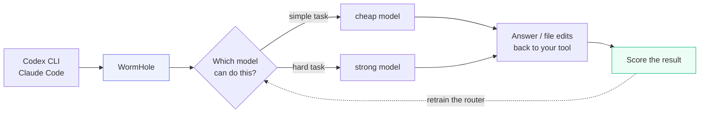

# WormHole

**Your coding agent doesn't need the most expensive model for every task.**

WormHole is a small local gateway that sits between your coding tool and the
model providers. It looks at each request, picks the cheapest model that can
actually handle it, and gets out of the way.

You keep using Codex CLI or Claude Code exactly as you do now.


---

## What it does

- **Routes each request** to the cheapest capable model, using a classifier that runs on your machine
- **Improves weak models' output** by rewriting the prompt before sending it to a cheaper tier
- **Scores every completion** and feeds the scores back into the router, so routing gets better with use
- **Logs everything** — which model ran, what it cost, how it scored — on a local dashboard

Everything runs on your laptop. Your prompts go to the model providers you
configure, and nowhere else.

---

## How it works



---

## The 60-second version

**Two small models do the thinking, and they live on your laptop.**

**1. The router** decides where each request goes. It is a scikit-learn
classifier in `models/router_slm.joblib` — text in, model name out, about a
millisecond, no network call. It ships trained on a generated benchmark set:
several thousand prompts spanning easy, medium and hard versions of coding,
maths and reasoning tasks, each labelled with the cheapest model whose published
benchmark scores clear that difficulty. That is enough to be useful on day one
and no more.

**2. The enhancer** rewrites the prompt when the request is heading for a weaker
model, spelling out the constraints and expected output that a stronger model
would have inferred. Strong tiers skip it.

**3. The judge** scores the result out of 10 after each turn. It sees the tool
calls the agent made, not just its prose, so an agent that quietly did the work
is not marked down for failing to paste code.

**4. Retraining closes the loop.** The scores become router training data:

```
score >= 7  ->  the model that ran was good enough, so this prompt is
                labelled with it
score <  7  ->  the task needed more than it got, so this prompt is
                relabelled one tier up
no score    ->  ignored
```

```bash
curl -X POST http://127.0.0.1:8000/api/router/retrain
# {"status":"success","feedback_examples_used":114, ...}
```

Retraining combines those judged prompts with the original benchmark set and
rebuilds the classifier. This matters because the shipped router is trained on
generated templates: it matches phrasing like theirs well and generalises from
them poorly. Your real prompts are what fix that, so expect it to improve over
weeks of use rather than immediately.

---

## Quickstart

Needs **Python 3.10+** and an API key for at least one provider.

```bash
git clone https://github.com/vencat2025/Wormhole.git
cd Wormhole

python3 -m venv .venv
source .venv/bin/activate        # Windows: .venv\Scripts\activate
pip install -r requirements.txt

cp .env.example .env             # then add at least one API key
```

Start it:

```bash
uvicorn main:app --host 127.0.0.1 --port 8000
```

Open <http://127.0.0.1:8000> for the dashboard. Check it works:

```bash
pytest tests/ -q
```

### Getting a key

You only need one. Cheapest to start with:

| Provider | Where | Notes |
|---|---|---|
| **Groq** | [console.groq.com/keys](https://console.groq.com/keys) | Free tier available. Good place to start. |
| **Ollama** | [ollama.com](https://ollama.com) | Runs locally, no key, no cost. `ollama pull qwen2.5-coder:7b` |
| OpenAI | [platform.openai.com](https://platform.openai.com/api-keys) | Needs billing credits |
| Google | [aistudio.google.com](https://aistudio.google.com/apikey) | Needs billing credits |

Models whose provider has no key are skipped automatically, so an
`.env` with only `GROQ_API_KEY` set is a perfectly valid setup.

---

## Point your coding tool at it

### Codex CLI

Add to `~/.codex/config.toml`:

```toml
model_provider = "wormhole"

[model_providers.wormhole]
name = "WormHole"
base_url = "http://127.0.0.1:8000/v1"
wire_api = "responses"
```

Then use Codex normally:

```bash
codex "add a health check endpoint"
```

### Claude Code

```bash
export ANTHROPIC_BASE_URL="http://127.0.0.1:8000"   # note: no /v1 here
export ANTHROPIC_API_KEY="any-non-empty-value"
claude
```

> Claude Code sends around 40k tokens per turn, which exceeds a Groq free-tier
> account's per-minute limit. It needs a paid tier or a large local model. Codex
> works on the free tier because it sends far less.

---

## Two ways to run it

**Proxy mode** (default) — WormHole handles the request, so you get routing,
prompt enhancement, scoring and full cost logging. Billed per token to whichever
provider it picks.

**Advisory mode** — WormHole only picks the model, and your tool makes the call
itself. Useful with a ChatGPT subscription, where per-token billing would cost
more than the plan you already pay for:

```bash
scripts/codex-routed "rename userCnt to userCount"
# → routed to gpt-5.6-luna: simple rename, a light tier handles it
```

|  | Proxy | Advisory |
|---|---|---|
| Billing | per token | your existing subscription |
| Chooses model | every turn | once per session |
| Enhancer, scoring, learning loop | yes | no |
| Cost dashboard | full | tier usage only |

---

## Configuration

All optional — set in `.env`. See `.env.example` for the full list.

| Setting | Default | What it does |
|---|---|---|
| `ROUTING_PROVIDERS` | all | Restrict to one vendor, e.g. `openai` |
| `ROUTING_MODELS` | all | Restrict to an exact list of approved models |
| `ROUTER_MODE` | `auto` | `slm` (local, instant), `llm` (smarter, ~300ms), `auto` |
| `ENHANCE_TIERS` | `basic,medium` | Which model tiers get prompt enhancement |
| `ENABLE_AUTH` | `false` | Require a bearer token on the gateway |

Editing the model list itself — adding a model, changing a price, marking a
model unsuitable for tool use — happens in `CANDIDATE_MODELS` in `config.py`.

---

## How it learns

Every completion is scored by a judge model, and those scores become training
data for the router:

```bash
curl -X POST http://127.0.0.1:8000/api/router/retrain
```

A good score means the model that ran was adequate for that prompt, so it
becomes a training label. A poor score relabels the prompt one tier up: the task
needed more than it got. Unscored requests are ignored.

Expect the router to improve as traffic accumulates, not immediately. It ships
trained on synthetic benchmark prompts, which it matches well and generalises
from poorly.

### Choosing the judge

The judge runs on every completion, so it wants to be cheap. But it is also the
only thing steering the router, so a judge that cannot tell good work from bad
will actively make routing worse.

The test that matters is whether it separates an agent that **did the work**
from one that **wrote a tutorial** — the failure this project exists to prevent.
Same task, same rubric, scored 1-10:

| `JUDGE_MODEL` | did the work | wrote a tutorial | separates? | speed | cost |
|---|---|---|---|---|---|
| `groq/openai/gpt-oss-20b` *(default)* | 10 | 1 | yes | 0.7s | free tier |
| `groq/openai/gpt-oss-120b` | 10 | 2 | yes | 0.8s | free tier |
| `ollama/gemma3:12b` | 10 | 1 | yes | ~25s | free, local |
| `ollama/qwen2.5-coder:7b` | 10 | **8** | **no** | ~9s | free, local |

Reproduce this on your own hardware before trusting a judge you have not tested.

**For a fully local setup**, use `JUDGE_MODEL=ollama/gemma3:12b`. It judges as
well as the cloud models here and nothing leaves the machine. It is slow, but
judging happens in the background after the response has already been streamed
to you, so it does not delay anything you see.

**Do not use a small coding model as the judge.** `qwen2.5-coder:7b` rates a
tutorial 8 out of 10. Every one of those scores would teach the router that
models which explain instead of acting are doing fine.

A judge is best at least as capable as the models it grades. The default is a
20B model scoring work sometimes done by a 120B one, which is a real limitation
on the signal — `groq/openai/gpt-oss-120b` costs more per turn and gives a
better one.

---

## What the numbers mean

The dashboard reports cost savings. Be precise about what that is:

- **Measured:** which model served each request, request counts, routing decisions
- **Estimated:** token counts on streamed requests, which are approximated from text length rather than provider-reported usage
- **Constructed:** the savings figure prices the same tokens against GPT-4o rates. It is a comparison, not an observed bill

Reproduce it on your own data:

```bash
python scripts/measure_savings.py
```

**Quality is not benchmarked.** The only quality signal is one model grading
another. Treat it as a hint, not a measurement.

---

## Project layout

```
main.py              API endpoints and the dashboard
config.py            Model fleet, pricing, routing policy
services/
  router.py          Picks the model
  enhancer.py        Rewrites prompts for weaker models
  dispatcher.py      Calls providers, handles streaming and failover
  judge.py           Scores completions
  feedback.py        Turns scores into router training data
models/              Local classifiers + their training scripts
scripts/             Dataset builders, measurement, demo recordings
```

---

## Status

A working single-developer project, not a hardened product. Developed and tested
against **Groq** and **local Ollama**; other providers are wired up but have had
less exercise.

Issues and pull requests welcome. Please run `pytest tests/ -q` before opening a PR.

## License

Apache 2.0 — see [LICENSE](LICENSE).
