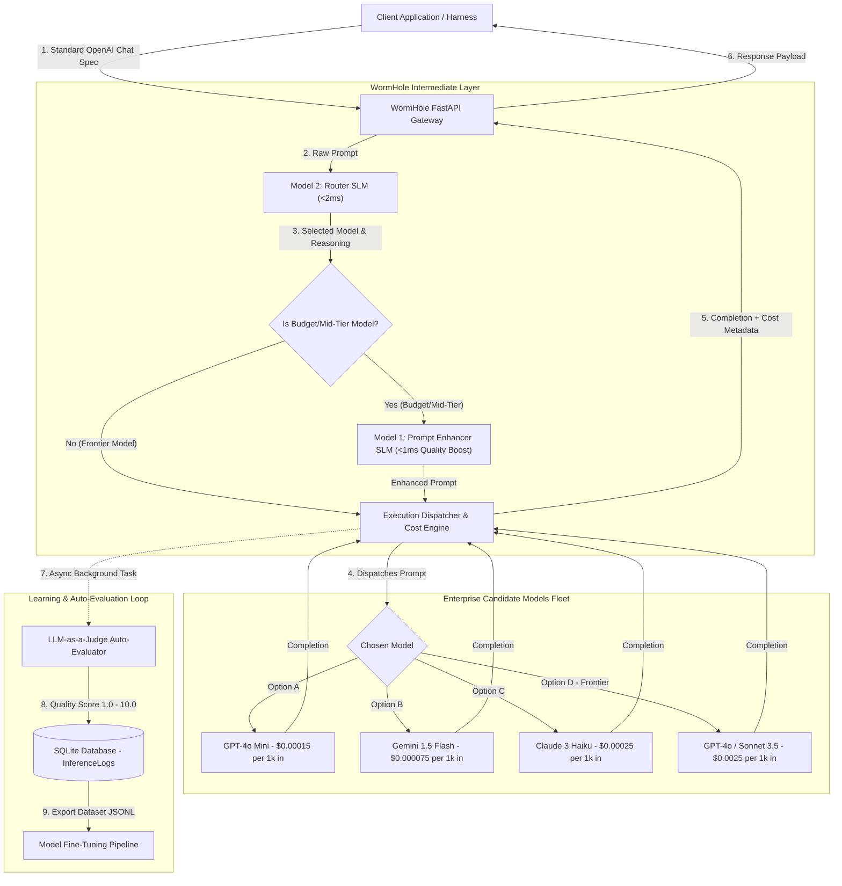

# WormHole — Enterprise AI Inference Cost Reducer

**WormHole** is an enterprise AI inference middleware layer designed to drastically reduce LLM API spend while preserving or elevating completion quality. 


It introduces a dual-model intermediate layer between your client application harness and downstream LLM providers:
1. **Prompt Enhancer (Model 1)**: Quality-enriches and structures the user prompt so smaller, cheaper models achieve frontier-quality output.
2. **Router Model (Model 2)**: Evaluates the enhanced prompt against registered enterprise models and dynamically routes it to the lowest-cost model capable of handling the task.

---

## 🏗️ Architecture & System Flow



---

## 🔄 Step-by-Step Processing Pipeline

### 1. Request Ingestion (`/v1/chat/completions`)
Client applications send standard OpenAI-formatted completion payloads. WormHole acts as a drop-in replacement proxy.

### 2. Router Decision (Model 2 Local SLM)
- **File**: [`services/router.py`](file:///Users/venkat/Documents/AI/WormHole/services/router.py)
- Evaluates raw prompt complexity in **< 2 milliseconds** against registered enterprise models and benchmark capability profiles.

### 3. Selective Prompt Enhancement (Model 1 Local SLM)
- **File**: [`services/enhancer.py`](file:///Users/venkat/Documents/AI/WormHole/services/enhancer.py)
- **If a Frontier Model is selected** (`gpt-4o`, `claude-3-5-sonnet`): Prompt enhancement is **bypassed** to save unnecessary latency and token overhead.
- **If a Budget/Mid-Tier Model is selected** (`gpt-4o-mini`, `gemini-1.5-flash`, `llama3.1`): Model 1 quality-enriches the prompt in **< 1 millisecond** so the budget model outputs frontier-level completions.
- **File**: [`services/enhancer.py`](file:///Users/venkat/Documents/AI/WormHole/services/enhancer.py)
- Takes terse or unformatted user prompts and enriches them with clear instructions, expected output structure, and edge-case handling guidelines.
- **Goal**: Quality maximization—ensuring that lower-cost downstream models receive sufficient context to output top-tier code/text.

### 3. Router Decision (LLM Model 2)
- **File**: [`services/router.py`](file:///Users/venkat/Documents/AI/WormHole/services/router.py)
- Inspects the enhanced prompt and matches its complexity against the registered fleet of enterprise models and their token pricing.
- Outputs structured JSON specifying `selected_model` and `reasoning`.

### 4. Dispatch & Cost Accounting
- **File**: [`services/dispatcher.py`](file:///Users/venkat/Documents/AI/WormHole/services/dispatcher.py)
- Executes the API request via **LiteLLM**.
- Calculates actual input/output token cost vs. baseline cost (cost if routed to `gpt-4o`) and tracks exact dollar and percentage savings.

### 5. Asynchronous Auto-Evaluation (LLM-as-a-Judge)
- **File**: [`services/judge.py`](file:///Users/venkat/Documents/AI/WormHole/services/judge.py)
- Asynchronously grades completion quality on a scale of **1.0 to 10.0**.
- Persists judge score, feedback, latency, and costs to SQLite.

### 6. Learning & Fine-Tuning Dataset Generator
- **File**: [`services/dataset.py`](file:///Users/venkat/Documents/AI/WormHole/services/dataset.py)
- Exports high-scoring historical inferences into JSONL format for fine-tuning custom student models for Model 1 (Enhancer) and Model 2 (Router).

---

## 💰 Candidate Models & Cost Accounting

| Model ID | Provider | Input Cost / 1k | Output Cost / 1k | Intelligence Tier | Typical Speed |
|---|---|---|---|---|---|
| `gpt-4o-mini` | OpenAI | $0.00015 | $0.00060 | Medium | Fast |
| `gemini/gemini-1.5-flash` | Google | $0.000075 | $0.00030 | Medium | Ultra Fast |
| `claude-3-haiku-20240307` | Anthropic | $0.00025 | $0.00125 | Medium | Fast |
| `gemini/gemini-1.5-pro` | Google | $0.00125 | $0.00500 | High | Medium |
| `gpt-4o` | OpenAI | $0.00250 | $0.01000 | Frontier | Medium |
| `claude-3-5-sonnet-20240620` | Anthropic | $0.00300 | $0.01500 | Frontier | Medium |

---

## ⚔️ Competitive Analysis & Differentiation

For detailed feature comparison matrices, technological moats, and enterprise TCO breakdowns versus OpenRouter, Portkey, RouteLLM, Martian, and LiteLLM Enterprise, see **[COMPETITIVE_ANALYSIS.md](COMPETITIVE_ANALYSIS.md)**.

### Summary Comparison Matrix:

| Feature | ⚡ **WormHole** | 🔌 **OpenRouter** | 🔑 **Portkey** | 🔬 **RouteLLM** |
|---|---|---|---|---|
| **Model 1: Prompt Enhancer** | **Yes (Local SLM <1ms)** | ❌ No | ❌ No | ❌ No |
| **Model 2: Router Engine** | **Yes (Local SLM <2ms, $0 Cost)** | Static user lists | Rule-based configs | Matrix router |
| **Auto-Judge Feedback** | **Yes (1.0-10.0 scale)** | ❌ No | ❌ No | ❌ No |
| **Fine-Tuning Flywheel** | **Yes (JSONL Export & `/api/router/retrain`)** | ❌ No | ❌ No | ❌ No |
| **Deployment Model** | **100% Private VPC / Self-Hosted** | Third-party Cloud SaaS | Cloud / Self-Hosted | Open Source |

---

## 🔌 API Endpoints & Interfaces

### 1. OpenAI-Compatible Chat Proxy
```http
POST /v1/chat/completions
Content-Type: application/json

{
  "model": "wormhole-auto",
  "messages": [
    { "role": "user", "content": "Write a Python function to check if a string is a palindrome." }
  ]
}
```

### 2. Analytics & Historical Logs
```http
GET /api/logs
```
Returns summary metrics (total requests, total cost spent, total baseline cost, net savings $, net savings %, average judge score) and recent inference logs.

### 3. Registered Candidate Models
```http
GET /api/models
```

### 4. Fine-Tuning Dataset Export
```http
GET /api/dataset/export?target=router
GET /api/dataset/export?target=enhancer
```

### 5. Enterprise Web Dashboard
Access **`http://127.0.0.1:8000/`** in your browser for a live graphical analytics dashboard.

---

## ⚡ Quickstart & Local Execution

```bash
# Clone & Navigate to Repository
cd /Users/venkat/Documents/AI/WormHole

# Activate Virtual Environment
source .venv/bin/activate

# Install Dependencies
pip install -r requirements.txt

# Run Automated Test Suite
PYTHONPATH=. pytest

# Start Gateway Server
uvicorn main:app --host 127.0.0.1 --port 8000
```

---

## 📁 Repository Structure

```
WormHole/
├── config.py             # System configuration, API keys, & candidate model definitions
├── db/
│   ├── database.py       # SQLModel engine & session setup
│   └── models.py         # InferenceLog schema (prompts, costs, judge scores)
├── services/
│   ├── enhancer.py       # Model 1: Quality Prompt Enhancer Service
│   ├── router.py         # Model 2: Router LLM Decision Service
│   ├── judge.py          # LLM-as-a-Judge Auto-Evaluation Service
│   ├── dispatcher.py     # Execution Dispatcher & Real-time Cost Calculation Engine
│   └── dataset.py        # Fine-Tuning JSONL Dataset Exporter
├── tests/
│   ├── test_api.py       # API proxy & analytics endpoint unit tests
│   └── test_components.py # Unit tests for enhancer, router, dispatcher, judge, & exporter
├── main.py               # FastAPI application host, proxy, & Web Dashboard UI
└── requirements.txt      # Python dependencies
```
