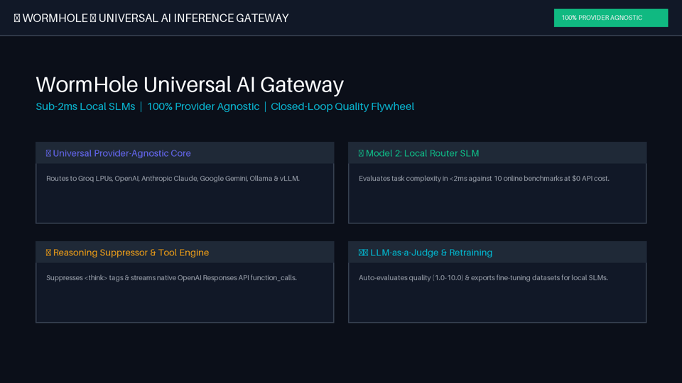
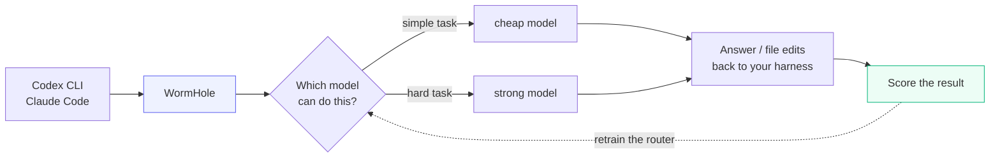

# WormHole

**Your harness doesn't need the most expensive model for every task.**

WormHole is a small local gateway that sits between your harness and the
model providers. (*Harness* is the tool you actually type into: Codex CLI,
Claude Code, OpenCode.) It looks at each request, picks the cheapest model that can
actually handle it, and gets out of the way.

You keep using Codex CLI or Claude Code exactly as you do now.



Two short recordings, both generated from real runs rather than mocked up
(`data/*_capture.json`, regenerated by the scripts in `scripts/`):

- [One routed run, in the terminal](docs/wormhole_terminal_demo.mp4) — routing
  decision, prompt enhancement, tokens, cost, judge score
- [The case for it, for a non-technical audience](docs/wormhole_exec_demo.mp4) —
  live routing decisions, measured cost, and the measured quality trade-off

Both label which figures are measured and which are constructed.

---

## What it does

- **Routes each request** to the cheapest capable model, using a classifier that runs on your machine
- **Improves weak models' output** by rewriting the prompt before sending it to a cheaper tier
- **Scores every completion** and feeds the scores back into the router, so routing gets better with use
- **Logs everything** — which model ran, what it cost, how it scored — on a local dashboard

Everything runs on your laptop. Your prompts go to the model providers you
configure, and nowhere else.

---

## How it works



---

## The 60-second version

Two small models run on your laptop and do the deciding.

1. **Router** — a scikit-learn classifier: text in, model name out, about a
   millisecond, no network call. Ships pre-trained on benchmark data.
2. **Enhancer** — rewrites the prompt when it is heading for a weaker model, so
   the cheaper tier gets a fair shot. Strong tiers skip it.
3. **Judge** — scores each result out of 10, reading the tool calls the agent
   made rather than only its prose.
4. **Retraining** — those scores become router training data.

The router therefore starts out generic and gradually learns *your* prompts.
[How it learns](#how-it-learns) has the details.

---

## Quickstart

Needs **Python 3.10+** and an API key for at least one provider.

```bash
git clone https://github.com/vencat2025/Wormhole.git
cd Wormhole

python3 -m venv .venv
source .venv/bin/activate        # Windows: .venv\Scripts\activate
pip install -r requirements.txt

cp .env.example .env             # then add at least one API key
```

Start it:

```bash
uvicorn main:app --host 127.0.0.1 --port 8000
```

Open <http://127.0.0.1:8000> for the dashboard. Check it works:

```bash
pytest tests/ -q
```

### Getting a key

You only need one. Cheapest to start with:

| Provider | Where | Notes |
|---|---|---|
| **Groq** | [console.groq.com/keys](https://console.groq.com/keys) | Free tier. **Start here** — it can drive a harness. |
| OpenAI | [platform.openai.com](https://platform.openai.com/api-keys) | Needs billing credits |
| Google | [aistudio.google.com](https://aistudio.google.com/apikey) | Needs billing credits |
| Ollama | [ollama.com](https://ollama.com) | Local, free — but see the warning below |

Models whose provider has no key are skipped automatically, so an `.env` with
only `GROQ_API_KEY` set is a perfectly valid setup.

**Ollama alone is not enough for a harness.** A local 7B model cannot
reliably drive Codex or Claude Code — it degrades to printing JSON as text
instead of calling tools — so it is excluded from agentic turns by design. Set
up with only Ollama and your first Codex turn has nothing to route to. The
gateway says so at startup rather than letting you discover it mid-task:

```
WARNING  Chat works (ollama/qwen2.5-coder:7b), but no tool-capable model is
         reachable, so Codex, Claude Code and OpenCode will fail on their first
         turn. Add a cloud provider key to .env.
```

Ollama is genuinely useful for plain chat and for trying the dashboard at zero
cost. For agents, pair it with one cloud key.

**One setting worth knowing now**, before you point an agent at this:

```bash
MIN_ROUTING_TIER=medium   # already the default in .env.example
```

Nothing weaker than that tier gets picked. Routed to the cheapest tier instead,
a one-line file-creation task in Claude Code spent 19 requests and never created
the file. [Full detail below](#setting-a-quality-floor).

---

## Your options, at a glance

|  | Interactive session | Exec / one-shot |
|---|---|---|
| **Codex** | `model_provider` in `~/.codex/config.toml` | `scripts/codex-routed --exec "task"` |
| **Claude Code** | `.envrc` via direnv, or `scripts/claude-routed` | `scripts/claude-routed -p "task"` |
| **OpenCode** | `opencode.json` in the project | `opencode run "task"` |

Interactive is a one-time config change, then you use the tool exactly as you
always have. Exec is for when something else is doing the calling.

---

## Interactive mode: point your harness at the gateway

Configure the tool once and then work normally. Each tool has its own file for
this — except Claude Code, which needs an environment variable instead, for
reasons worth reading before you try the config file.

### Codex — `~/.codex/config.toml`

```toml
model_provider = "wormhole"

[model_providers.wormhole]
name = "WormHole"
base_url = "http://127.0.0.1:8000/v1"
wire_api = "responses"
```

Then use Codex normally:

```bash
codex "add a health check endpoint"
```

**One caveat worth knowing.** On macOS the Codex desktop app reads this same
file (`CODEX_HOME=~/.codex`), so the top-level `model_provider` line redirects
the app too — including sessions on a ChatGPT subscription, which then bill per
token through the gateway rather than against the plan you already pay for. If
you would rather keep that billing, drop the top-level line and select the
provider per run instead:

```bash
codex -c model_provider="wormhole" "add a health check endpoint"
```

...or skip proxying Codex altogether and use the advisory wrapper further down,
which keeps the traffic on your own subscription.

### Claude Code — environment, not a config file

Claude Code has no config-file equivalent for this, and the near-miss is worth
stating plainly because it fails silently.

**`.claude/settings.json` will not work.** Putting `ANTHROPIC_BASE_URL` in that
file under `env` is ignored — Claude Code reads that variable from the process
environment only. The trap is that *other* keys in the same file are honoured,
so the file looks like it took effect. Measured here: a settings-file session
completed its task normally and the gateway logged **zero** requests for it. It
had been talking to Anthropic the whole time.

So the equivalent is an environment variable. For a project you always want
routed, scope it to that directory with [direnv](https://direnv.net) — an
`.envrc` in the project root:

```bash
export ANTHROPIC_BASE_URL="http://127.0.0.1:8000"   # no /v1 — Claude appends it
export ANTHROPIC_AUTH_TOKEN="local-gateway"
```

Then `claude` behaves normally inside that directory and is untouched everywhere
else. Without direnv, `scripts/claude-routed` with no arguments opens the same
interactive session:

```bash
scripts/claude-routed
```

**Do not put those exports in your shell profile.** That sends *every* Claude
session on the machine through the gateway — including work you want billed to
your Anthropic subscription, and including private repositories you never meant
to route anywhere.

Do not set `ANTHROPIC_MODEL` either. Claude Code validates model ids
client-side and rejects names it does not recognise, so `wormhole-auto` fails
before a request is sent. Leave it unset and let the gateway route.

**Which models can actually drive Claude Code.** Claude Code's agentic loop is
demanding, and the cheap tiers do not survive it. Routed to `gpt-5-nano`, a
one-line "create this file" task burned 19 requests and never created the file.
Set a floor before routing real work:

```bash
export ROUTING_MODELS="gpt-4o-mini,gpt-4o"   # in the gateway's own .env
```

### OpenCode

Create `opencode.json` in your project:

```json
{
  "$schema": "https://opencode.ai/config.json",
  "provider": {
    "wormhole": {
      "npm": "@ai-sdk/openai-compatible",
      "name": "WormHole Local Gateway",
      "options": { "baseURL": "http://127.0.0.1:8000/v1", "apiKey": "wh-local" },
      "models": { "wormhole-auto": { "name": "WormHole Auto Router" } }
    }
  },
  "model": "wormhole/wormhole-auto"
}
```

```bash
opencode run "add a health check endpoint"
```

OpenCode refuses writes outside the directory it was started in
(`permission requested: external_directory; auto-rejecting`). Run it from your
project root, and add `--auto` for non-interactive runs if you want it to
proceed without prompting.

OpenCode picks one model per session and has no task-based routing of its own,
so the routing here is additive rather than duplicated.

Verified against the free Groq tier:

| Harness | Free tier (Groq/Ollama) | Paid provider | Note |
|---|---|---|---|
| **Codex CLI** | yes | yes | ~5k tokens per turn after tool budgeting |
| **OpenCode** | yes | yes | small payload; created files and passing tests |
| **Claude Code** | no | **yes** | ~30k tokens per turn. Exceeds Groq's 8k/minute free ceiling; fine on a provider without one |

All three verified end to end, creating real files.

**Give agentic work a capable tier.** Claude Code sends a much larger preamble
than the others, and the weakest models lose the thread under it: routed to
`gpt-5-nano`, Claude Code reported creating a file, named a full path for it,
and had created nothing. The same request on `gpt-4o-mini` wrote the file
correctly. This is the failure mode the project exists to prevent, so if you run
Claude Code through the gateway, set a floor:

```bash
export ROUTING_MODELS="gpt-4o-mini,gpt-4o"
```

`scripts/evaluate_routing_quality.py` measures what a given floor costs or buys.

**The 5.6 reasoning tiers need the Responses API, and get it.** All three
(`gpt-5.6-luna`, `gpt-5.6-terra`, `gpt-5.6-sol`) reject function tools on
`/v1/chat/completions`:

```
Function tools with reasoning_effort are not supported for gpt-5.6-sol in
/v1/chat/completions. To use function tools, use /v1/responses or set
reasoning_effort to 'none'.
```

The two ways out are not equivalent. `reasoning_effort='none'` keeps the call
on chat completions by switching the reasoning off, which is a downgrade
wearing the model's name — you would be paying the top tier's price for a
model that no longer reasons. So the gateway sends these three over
`/v1/responses` instead, where tools and full reasoning coexist, and translates
the reply back to chat-completions shape (`services/openai_responses.py`).
Every surface gains them without knowing they work differently: verified
end-to-end through Codex, which created a file, then wrote and ran its own test
against it.

`gpt-5-nano`, `gpt-5-mini`, `gpt-5.4`, `gpt-4o` and `gpt-4o-mini` tool-call
normally on chat completions.

Reasoning models also spend output budget before answering — `gpt-5-nano` used
1,061 output tokens on a one-line task — so a low `max_tokens` can cut them off
mid-thought and look like a refusal.

---

## Two ways to run it

This is a separate axis from interactive-vs-exec: it is about whether your
traffic goes *through* the gateway or merely asks it for an opinion.

**Proxy mode** — your harness points at WormHole and every request flows through
it. You get routing, prompt enhancement, scoring and full cost logging, billed
per token to whichever provider it picks. Everything above is proxy mode: the
`config.toml` setup, the `.envrc`, `opencode.json`, and `claude-routed`.

**Advisory mode** — WormHole only *picks* the model; your harness then makes the
call itself, on its own credentials. Nothing but the prompt reaches the gateway.
Only `codex-routed` works this way, and it exists because Codex on a ChatGPT
subscription is already paid for — proxying it would move that same work onto
pay-per-token API billing and cost you more, not less.

|  | Proxy | Advisory (`codex-routed` only) |
|---|---|---|
| Billing | per token, to the picked provider | your existing subscription |
| Chooses model | every turn | once, from the opening task |
| Enhancer, scoring, learning loop | yes | no |
| Cost dashboard | full | tier usage only |
| Traffic through the gateway | all of it | the prompt only |

So `codex-routed` is the odd one out: it is the only way to get routing without
moving your billing onto API tokens.

---

## Exec mode: one-shot calls from other tools

When something *else* is doing the calling — a script, a Makefile, CI, a
pre-commit hook, another agent — you want one command that runs, prints, and
exits. That is what the wrappers are for. They also scope the redirect to that
single process, so nothing they do leaks into your other sessions.

### Codex — `codex-routed --exec`

```bash
scripts/codex-routed --exec "rename userCnt to userCount across the repo"
```

Runs non-interactively and exits. The same script without `--exec` opens the
normal Codex TUI, if you want the interactive session on a routed model without
editing `config.toml`:

```bash
scripts/codex-routed "add a health check endpoint"
```

Both print the decision to stderr before Codex starts, so you can see what it
chose:

```
→ routed to gpt-5.6-luna: simple rename, a light tier handles it
```

The model is chosen from the **opening task** and then fixed for the whole
session — the gateway sees one routing request, not one per turn. If the work
turns out harder than it looked, switch tiers with `/model` inside the TUI.

Point it at a different ladder if your account has other tiers:

```bash
export WORMHOLE_LADDER='[
  {"id":"gpt-5.6-luna","description":"light edits"},
  {"id":"gpt-5.5","description":"architecture and proofs"}
]'
```

Only ids your ChatGPT account may use belong there; plain API model ids are
rejected under subscription auth. Needs `curl` and `jq`.

### Claude Code — `claude-routed -p`

```bash
scripts/claude-routed -p "add a health check endpoint"
```

`-p` is exec mode; bare is the interactive TUI covered above. Everything after
the script name is passed straight through to `claude`, so your usual flags
still work:

```bash
scripts/claude-routed -p "fix the failing test" --permission-mode acceptEdits
```

Unlike the Codex wrapper this one is a true proxy — every turn is routed,
enhanced, scored and logged, and it bills per token rather than against your
Anthropic subscription.

### OpenCode — `opencode run`

OpenCode reads `opencode.json` from the project, so once that file is in place
(see above) both modes are already routed — no wrapper needed:

```bash
opencode run "add a health check endpoint"
```

### Checking it actually routed

The honest test is whether the gateway saw the traffic, not whether the task
succeeded — a session that quietly bypassed the gateway still works fine, which
is exactly what makes it easy to miss:

```bash
curl -s "http://127.0.0.1:8000/api/logs?limit=1" | jq '.summary.total_requests'
```

Run it before and after. If the number did not move, you were talking to the
provider directly.

---

## Setting a quality floor

The single most important setting if you point a harness at this:

```bash
MIN_ROUTING_TIER=medium   # basic | medium | high | frontier
```

Nothing below that tier will be chosen, no matter what the router thinks. This
matters because **advertising tool support is not the same as being able to
drive an agentic harness.** Routed to `gpt-5-nano` — a tier that calls tools
correctly and scores fine on short-answer benchmarks — a one-line "create this
file" task in Claude Code spent 19 requests and never created the file.

`medium` excludes that tier and keeps the cheap models that do hold up. Raise it
to `high` if you want only serious reasoning tiers in the pool.

You can also restrict by exact model or by vendor, which compose with the floor:

```bash
ROUTING_MODELS=gpt-4o-mini,gpt-4o    # an explicit ladder, nothing else
ROUTING_PROVIDERS=openai             # stay inside one vendor
```

Prefer the floor for ongoing use: an explicit list has to be rewritten every
time the fleet changes, whereas a floor keeps judging new models on their own
tier.

### Staying inside one model family

Setting the floor high does not mean paying the top price for everything. A
common policy is "only 5.6, but not always the expensive one":

```bash
ROUTING_MODELS=gpt-5.6-luna,gpt-5.6-terra,gpt-5.6-sol
ROUTER_MODE=llm
```

Every request then lands on a 5.6 reasoning model, and the router picks which
one. Measured on this ladder:

| Prompt | Routed to |
|---|---|
| rename `userCnt` to `userCount` | `luna` |
| add a docstring to `total()` | `luna` |
| fix the failing test in `test_invoice.py` | `terra` |
| make the payment engine idempotent across partial failures | `sol` |
| prove this sort is O(n log n) and hit that bound | `sol` |
| zero-downtime migration to shard the orders table | `sol` |

The spread is worth having: `luna` is **$0.0002 / $0.0012** per 1k in/out
against `sol` at **$0.0040 / $0.0200** — twenty times cheaper on input for the
renames and docstrings that make up most of a session, with `sol` still there
for the work that earns it.

That table was produced with `ROUTER_MODE=llm`. The local classifier gets the
cheap end of it right and still under-routes the hard end — see
[what the router can and cannot do](#what-the-router-can-and-cannot-do).

---

## Configuration

All optional — set in `.env`. See `.env.example` for the full list.

| Setting | Default | What it does |
|---|---|---|
| `ROUTING_PROVIDERS` | all | Restrict to one vendor, e.g. `openai` |
| `ROUTING_MODELS` | all | Restrict to an exact list of approved models |
| `ROUTER_MODE` | `auto` | `slm` (local, instant), `llm` (smarter, ~300ms), `auto` |
| `ENABLE_ENHANCEMENT` | `true` | Rewrite prompts for weak models (adds ~500ms latency, extra API call) |
| `ENHANCE_TIERS` | `basic,medium` | Which model tiers get prompt enhancement |
| `ENABLE_AUTH` | `false` | Require a bearer token on the gateway |
| `ENABLE_JUDGING` | `true` | Run LLM-as-judge on every completion (feeds learning loop) |
| `JUDGE_SAMPLE_RATE` | `1.0` | Fraction of completions to judge (0.0–1.0; 0.1 = judge 10%) |

### Cost vs. Quality Trade-Offs

**Routing** is free (local SLM, <2ms). **But enhancement and judging add overhead.**

**Prompt Enhancement** — rewrites weak-model prompts to be more explicit:
- Costs: ~500ms latency + extra API call per weak-model request
- Benefit: *Theory* that better prompts → better output from cheap models
- **No measured proof** that the cost is worth it on your workload
- Default: enabled; disable to cut latency and API costs

**Judging** — scores every completion to improve the router over time:
- Costs: ~10–30% extra on routed request cost (async, doesn't delay response)
- Benefit: router learns from your traffic, improves with use
- Default: enabled; disable if cost is more important than learning

**Pick your trade-off:**
```bash
# Maximize cost (disable learning and enhancement)
ENABLE_ENHANCEMENT=false
ENABLE_JUDGING=false

# Balance cost and learning (enable judging, disable enhancement)
ENABLE_ENHANCEMENT=false
ENABLE_JUDGING=true
JUDGE_SAMPLE_RATE=0.1  # judge 10% only

# Full quality (enable both, but sample judging)
ENABLE_ENHANCEMENT=true
ENABLE_JUDGING=true
JUDGE_SAMPLE_RATE=1.0

# Fully local (zero cloud overhead for learning)
ENABLE_ENHANCEMENT=true
ENABLE_JUDGING=true
JUDGE_MODEL=ollama/gemma3:12b
```

Editing the model list itself — adding a model, changing a price, marking a
model unsuitable for tool use — happens in `CANDIDATE_MODELS` in `config.py`.

---

## How it learns

Every completion is scored by a judge model, and those scores become training
data for the router:

```bash
curl -X POST http://127.0.0.1:8000/api/router/retrain
```

A judge score **bounds** the difficulty rather than measuring it, and reading it
symmetrically is a mistake this project made and has now fixed:

- A **failure** at some tier proves the task needs more than that tier. Real
  evidence, wherever it happens. The prompt is relabelled one tier up.
- A **success on a cheap tier** proves the task needs at most that tier. Real
  evidence, and the only way the router ever learns to route *down*.
- A **success on a strong tier** proves nothing — of course the expensive model
  managed it — so it is discarded rather than believed.

That last rule matters more than it sounds. Without it, every request a strong
model handled well taught the router that its prompt *required* a strong model.
Measured in this repository's own log: "How do I format a JSON string in
Python?" had been labelled **frontier**, purely because a 120B model answered it
well. Unscored requests, and requests where the judge was handed an empty
completion, are ignored entirely.

Retraining is a local command and needs no API key:

```bash
python models/train_router.py
```

The bootstrap set is built from real benchmark items — SWE-bench, HumanEval,
GSM8K, MATH, GPQA — fetched by `scripts/fetch_benchmark_prompts.py` and cached
rather than committed. Tier labels come from measured difficulty: SWE-bench
instances below a 0.2 pass rate across the published field are frontier, and
GPQA is graduate-level by construction.

Expect the router to improve as your traffic accumulates. The bootstrap gives it
real task phrasing, but its labels come from published benchmark pass rates
rather than from watching which model actually succeeded on *your* prompts. Your
judged traffic is what replaces those approximations, and it is the only thing
that closes the short-instruction gap described below.

### What the router can and cannot do

The classifier predicts a **capability tier** — basic, medium, high, frontier —
and not a model id. That is the whole design, and it is what makes the routing
work against whatever keys you have added:

```
prompt ──► classifier ──► "this needs the 'high' tier"
                              │
                              ▼
             cheapest model you can reach that clears 'high'
```

A tier is a property of the prompt. "This task needs real reasoning" stays true
whether you have one provider key or five. A model id is a property of your
fleet, so the moment the fleet changes, every label a model-id classifier
learned is wrong. That was not hypothetical: pointed at an all-5.6 ladder, the
previous classifier's labels had all ceased to exist, and a rename and a
zero-downtime sharding migration both landed on the cheapest tier. Add a
provider key now and the pool widens on the very next request, with no
retraining.

**Where it is honest to say it works.** Bootstrap labels come from measured
benchmark difficulty, not opinion: SWE-bench publishes a per-instance pass rate
across 134 systems, so the instances almost nothing solved are the ones marked
frontier. The classifier scores about **90% on a held-out split** of that data
and decides in **under a millisecond**, locally, with no network call.

**Where it is weak, measured.** Held-out benchmark accuracy is not the same as
accuracy on what you type at a harness. On seven short instructions the local
classifier put the three easy ones (`rename`, `add a docstring`, `write a
regex`) on the cheapest tier correctly, and under-routed the hard ones — it
rates "design a zero-downtime migration to shard the orders table" as *medium*.
The cause is coverage, not labelling: every hard example in the bootstrap is a
multi-paragraph bug report or a maths problem, and nothing in it is a short
imperative sentence that happens to be hard.

This is the gap your own traffic closes, and it is the reason the learning loop
exists. Until it does, `MIN_ROUTING_TIER` is the guard that matters: it bounds
how far wrong an under-route can go.

**One more thing worth knowing before you read a small saving as a bug.**
Routing down only saves money if something cheaper exists. If the cheapest
model that can drive a harness is already a strong tier — Groq's free
`gpt-oss-20b` is `high` at $0.000075/1k — then every decision correctly lands
there and the gateway has nothing to save. The gateway says so at startup:

```
INFO  Cheapest tool-capable model (groq/openai/gpt-oss-20b) is already 'high'
      tier, so most requests will route there and cost savings will be small.
      Add a cheaper capable model to widen the spread.
```

### Choosing the judge

The judge runs on every completion, so it wants to be cheap. But it is also the
only thing steering the router, so a judge that cannot tell good work from bad
will actively make routing worse.

The test that matters is whether it separates an agent that **did the work**
from one that **wrote a tutorial** — the failure this project exists to prevent.
Same task, same rubric, scored 1-10:

| `JUDGE_MODEL` | did the work | wrote a tutorial | separates? | speed | cost |
|---|---|---|---|---|---|
| `groq/openai/gpt-oss-20b` *(default)* | 10 | 1 | yes | 0.7s | free tier |
| `groq/openai/gpt-oss-120b` | 10 | 2 | yes | 0.8s | free tier |
| `ollama/gemma3:12b` | 10 | 1 | yes | ~25s | free, local |
| `ollama/qwen2.5-coder:7b` | 10 | **8** | **no** | ~9s | free, local |

Reproduce this on your own hardware before trusting a judge you have not tested.

**For a fully local setup**, use `JUDGE_MODEL=ollama/gemma3:12b`. It judges as
well as the cloud models here and nothing leaves the machine. It is slow, but
judging happens in the background after the response has already been streamed
to you, so it does not delay anything you see.

**Do not use a small coding model as the judge.** `qwen2.5-coder:7b` rates a
tutorial 8 out of 10. Every one of those scores would teach the router that
models which explain instead of acting are doing fine.

A judge is best at least as capable as the models it grades. The default is a
20B model scoring work sometimes done by a 120B one, which is a real limitation
on the signal — `groq/openai/gpt-oss-120b` costs more per turn and gives a
better one.

---

## What the numbers mean

The dashboard reports cost savings. Be precise about what that is:

The dashboard reports **only what actually happened**: which model served each
request, how many requests there were, the tokens each used as reported by the
provider, what that cost at litellm's published rates, and the share of traffic
that stayed off the most expensive tier.

It deliberately does **not** show a "savings versus GPT-4o" figure. That number
would price your tokens against a model that never ran, which is a projection
dressed as a measurement and the first thing a sceptical reader would pull on.

For a like-for-like comparison, run the benchmark below. It executes both a
routed arm and a fixed-strong-model arm over the same tasks, so both sides of
the comparison are real.

Reproduce it on your own data:

```bash
python scripts/measure_savings.py
```

### Does routing cost you quality?

You can measure it. `scripts/evaluate_routing_quality.py` runs MBPP problems
through the router and through a fixed strong model, then executes both answers
against MBPP's own assertions — correctness is the test suite passing, not a
model's opinion.

```bash
python scripts/evaluate_routing_quality.py --n 24 --baseline gpt-4o
```

**The answer depends entirely on which models you let it pick.** Same tasks,
same baseline:

| Fleet the router could choose from | Routed | Baseline `gpt-4o` | Quality | Cost |
|---|---|---|---|---|
| Default, including the free local 7B | 14/24 (58.3%) | 20/24 (83.3%) | **−25.0 pts** | 100% lower |
| OpenAI tiers only (`gpt-5-nano` … `gpt-4o`) | 60/72 (83.3%) | 61/72 (84.7%) | **−1.4 pts** | 96% lower |

Routing to the free local model costs real accuracy — that gap is large enough
to be the finding, not the noise.

Routing within OpenAI's own tiers is a different story: over three runs of 24
tasks, routing solved 60 and always-`gpt-4o` solved 61. **One task apart, which
on 72 samples is noise.** The cost difference is not noise. The honest reading
is *the same work for about a twenty-fifth of the price*, not "routing is more
accurate".

Per-run, routed vs baseline: 21/21, 20/20, 19/20. If you re-run it you will get
your own spread; that is what a sample this size looks like.

**Read tasks solved, not pass rate.** When a call fails outright, that arm
attempted fewer questions. Dividing its wins by the smaller number flatters it:
an arm that errored twice and solved exactly as many tasks scores several points
"higher" purely for having been asked less. An earlier version of this README
reported +8.0 points from precisely that artifact — both arms had solved 21. The
harness now leads with solves out of tasks *given* and labels the error-adjusted
figure as the secondary, non-like-for-like number it is.

So the useful question is not "does routing hurt quality" but "which floor do
you set". Use `ROUTING_MODELS` to set it, and re-run the benchmark to see what
that choice costs or buys on your own fleet.

**Give reasoning models room.** They spend most of their output budget thinking
before answering. `--max-tokens` defaults to 3000 for that reason: at 700,
`gpt-5-nano` returned `finish_reason=length` with no content at all, and an
earlier run of this benchmark scored that as failure and reported −58 points.
The harness now flags truncation instead of counting it as a wrong answer.

The LLM-as-judge score in the dashboard is a different thing: one model grading
another, with no ground truth. Treat it as a hint. This benchmark is the
measurement.

---

## Regenerating the demo video

```bash
python scripts/record_exec_demo.py                    # silent, no key needed
WORMHOLE_VOICE=1 python scripts/record_exec_demo.py   # narrated
```

Narration is spoken from the same caption lines the slides already display, so
there is no second script to keep in sync. Clips are cached under
`data/narration_cache/` keyed by a hash of the exact text: the first narrated
render costs about three cents, and every render after it costs nothing unless
you change the wording, in which case you pay only for the lines that changed.

Slide durations are a floor, never a ceiling — a slide holds for its written
duration or its narration's length, whichever is longer, so audio is never
clipped and a slide never gets shorter than it was tuned to be for reading.

`WORMHOLE_VOICE_NAME` and `WORMHOLE_VOICE_MODEL` override the voice. Technical
strings get a spoken form before synthesis (`MIN_ROUTING_TIER=medium` is read
as "min routing tier set to medium"), which is what stops it sounding like a
machine reading a config file.

---

## Project layout

```
main.py              API endpoints and the dashboard
config.py            Model fleet, pricing, routing policy
services/
  router.py          Picks the model
  enhancer.py        Rewrites prompts for weaker models
  dispatcher.py      Calls providers, handles streaming and failover
  judge.py           Scores completions
  feedback.py        Turns scores into router training data
models/              Local classifiers + their training scripts
scripts/             Dataset builders, measurement, demo recordings
```

---

## Status

A working single-developer project, not a hardened product. Developed and tested
against **Groq** and **local Ollama**; other providers are wired up but have had
less exercise.

Issues and pull requests welcome. Please run `pytest tests/ -q` before opening a PR.

## License

Apache 2.0 — see [LICENSE](LICENSE).
