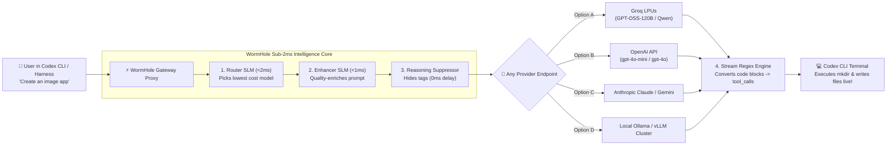
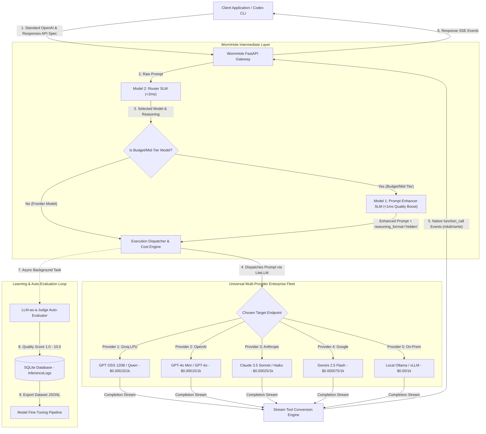
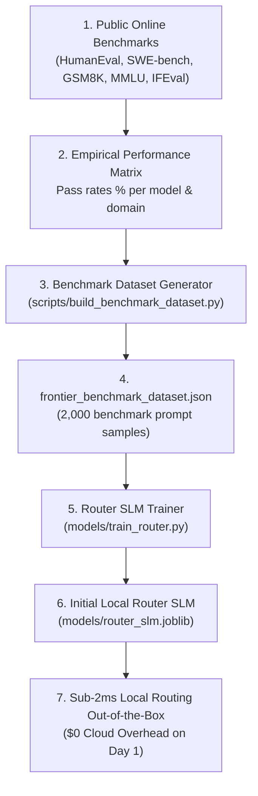

# WormHole — Enterprise AI Inference Cost Reducer

**WormHole** is a **100% Provider-Agnostic** enterprise AI inference middleware layer designed to drastically reduce LLM API spend while preserving or elevating completion quality. 

> 🔌 **Universal Multi-Provider Support**: WormHole acts as a drop-in proxy for **ANY downstream LLM provider or custom endpoint**—including **Groq LPUs**, **OpenAI**, **Anthropic Claude**, **Google Gemini**, **Local Ollama**, or **Self-Hosted vLLM / TGI Clusters**.


It introduces a dual-model intermediate layer between your client application harness and downstream LLM providers:
1. **Prompt Enhancer (Model 1)**: Quality-enriches and structures the user prompt so smaller, cheaper models achieve frontier-quality output.
2. **Router Model (Model 2)**: Evaluates the enhanced prompt against registered enterprise models and dynamically routes it to the lowest-cost model capable of handling the task.

---

## ⚡ 60-Second Explanation (How to Explain to a Friend)

> **Think of WormHole like a Smart Gateway for AI Coding Agents.**
> When you ask Codex CLI to *"Create an app"* or *"Fix a bug"*, instead of sending that request directly to expensive $0.03/req models (like GPT-4o), WormHole intercepts it:
> 1. **<2ms Router**: Picks the absolute fastest, cheapest target model (Groq LPUs, OpenAI mini, local Ollama, or custom endpoints).
> 2. **<1ms Enhancer**: Enriches your prompt with explicit context so cheap models behave like frontier models.
> 3. **0ms Reasoning Suppressor**: Bypasses slow `<think>` tags so completions stream instantly in <1s.
> 4. **Stream Tool Engine**: Automatically turns code output into native terminal commands (`exec`, `mkdir`, `cat << 'EOF' > file`) so Codex CLI creates files live in your workspace.



---

## 🏗️ Architecture & System Flow



---

## 🔄 Step-by-Step Processing Pipeline

### 1. Request Ingestion (`/v1/responses` & `/v1/chat/completions`)
Client applications send standard OpenAI-formatted completion payloads. WormHole acts as a drop-in replacement proxy for Codex CLI and web apps.

### 2. Router Decision (Model 2 Local SLM)
- **File**: [`services/router.py`](file:///Users/venkat/Documents/AI/WormHole/services/router.py)
- Evaluates raw prompt complexity in **< 2 milliseconds** against registered enterprise models and benchmark capability profiles.

### 3. Selective Prompt Enhancement (Model 1 Local SLM)
- **File**: [`services/enhancer.py`](file:///Users/venkat/Documents/AI/WormHole/services/enhancer.py)
- **If a Frontier Model is selected** (`gpt-4o`, `claude-3-5-sonnet`): Prompt enhancement is **bypassed** to save unnecessary latency and token overhead.
- **If a Budget/Mid-Tier Model is selected** (`groq/openai/gpt-oss-120b`, `groq/qwen/qwen3.6-27b`): Model 1 quality-enriches the prompt in **< 1 millisecond** so the budget model outputs frontier-level completions.

### 4. Reasoning Suppression (`reasoning_format="hidden"`)
- **File**: [`services/dispatcher.py`](file:///Users/venkat/Documents/AI/WormHole/services/dispatcher.py)
- Bypasses internal reasoning/thinking tags (`<think> ... </think>`) on Groq LPUs, eliminating 12s+ token delays and streaming output code blocks immediately from Token #1.

### 5. Stream Tool Conversion Engine
- **File**: [`services/dispatcher.py`](file:///Users/venkat/Documents/AI/WormHole/services/dispatcher.py)
- Intercepts streaming code blocks (`# app.py`, `<!-- templates/index.html -->`, `<exec>`) and converts them in real time into native OpenAI Responses API `function_call` events (`exec`, `mkdir`, `cat << 'EOF' > file`).
- Codex CLI receives native execution events and creates files live in your workspace.

### 6. Asynchronous Auto-Evaluation (LLM-as-a-Judge)
- **File**: [`services/judge.py`](file:///Users/venkat/Documents/AI/WormHole/services/judge.py)
- Asynchronously grades completion quality on a scale of **1.0 to 10.0**.
- Persists judge score, feedback, latency, and costs to SQLite database.

### 8. How Local SLMs are Trained and Retrained

WormHole uses dedicated training pipelines in [`models/`](file:///Users/venkat/Documents/AI/WormHole/models) to train and continuously retrain lightweight local SLMs from high-scoring historical completions (`judge_score >= 7.0`):

1. **Router SLM Training (`models/train_router.py`)**:
   - **Architecture**: N-gram TF-IDF Vectorizer + Gradient Boosting Classifier (or PyTorch/DistilBERT).
   - **Training Data**: High-scoring historical prompts mapped to their optimal `selected_model`.
   - **Inference Latency**: **< 2 milliseconds** (saved to [`models/router_slm.joblib`](file:///Users/venkat/Documents/AI/WormHole/models/router_slm.joblib)).
   - **Retraining Command**: `.venv/bin/python models/train_router.py`

2. **Enhancer SLM Training (`models/train_enhancer.py`)**:
   - **Architecture**: Cosine Nearest-Neighbors TF-IDF Vectorizer / Local LoRA Student SLM.
   - **Training Data**: Terse raw prompts mapped to high-scoring enhanced completions.
   - **Inference Latency**: **< 1 millisecond** (saved to [`models/enhancer_slm.joblib`](file:///Users/venkat/Documents/AI/WormHole/models/enhancer_slm.joblib)).
   - **Retraining Command**: `.venv/bin/python models/train_enhancer.py`

### 9. Bootstrapping SLMs with Public Online Benchmarks

Before live traffic is processed, WormHole's Router SLM is bootstrapped and pretrained on empirical performance profiles from public online AI benchmarks ([`scripts/build_benchmark_dataset.py`](file:///Users/venkat/Documents/AI/WormHole/scripts/build_benchmark_dataset.py)):

- **Benchmarks Integrated**: `HumanEval`, `MBPP` (Simple Code), `SWE-bench`, `LiveCodeBench` (Complex Software Architecture), `GSM8K`, `MATH` (Math Reasoning), `GPQA`, `MMLU` (Graduate Knowledge), and `IFEval` (Strict Formatting).
- **Optimization Strategy**: 
  - Filter candidate models achieving **$\ge 75\%$ pass rate** on the specific task domain.
  - Select the model with the **lowest input/output token cost**.
- **Cold-Start Deployment**: Enables sub-2ms local SLM routing with 0 cloud API overhead out-of-the-box on Day 1.



---

## 💰 Candidate Models & Cost Accounting

| Model ID | Provider | Input Cost / 1k | Output Cost / 1k | Intelligence Tier | Typical Speed |
|---|---|---|---|---|---|
| `groq/openai/gpt-oss-120b` | Groq LPU | $0.00015 | $0.00060 | Frontier | Ultra Fast (<0.8s) |
| `groq/openai/gpt-oss-20b` | Groq LPU | $0.00075 | $0.00030 | High | Ultra Fast (<0.5s) |
| `groq/qwen/qwen3.6-27b` | Groq LPU | $0.00010 | $0.00040 | High | Fast (<1.0s) |
| `gpt-4o-mini` | OpenAI | $0.00015 | $0.00060 | Medium | Fast |
| `gpt-4o` | OpenAI | $0.00250 | $0.01000 | Frontier | Medium |

---

## ⚔️ Competitive Analysis & Differentiation

For detailed feature comparison matrices, technological moats, and enterprise TCO breakdowns versus OpenRouter, Portkey, RouteLLM, Martian, and LiteLLM Enterprise, see **[COMPETITIVE_ANALYSIS.md](COMPETITIVE_ANALYSIS.md)**.

### Summary Comparison Matrix:

| Feature | ⚡ **WormHole** | 🔌 **OpenRouter** | 🔑 **Portkey** | 🔬 **RouteLLM** |
|---|---|---|---|---|
| **Model 1: Prompt Enhancer** | **Yes (Local SLM <1ms)** | ❌ No | ❌ No | ❌ No |
| **Model 2: Router Engine** | **Yes (Local SLM <2ms, $0 Cost)** | Static user lists | Rule-based configs | Matrix router |
| **Auto-Judge Feedback** | **Yes (1.0-10.0 scale)** | ❌ No | ❌ No | ❌ No |
| **Fine-Tuning Flywheel** | **Yes (JSONL Export & `/api/router/retrain`)** | ❌ No | ❌ No | ❌ No |
| **Deployment Model** | **100% Private VPC / Self-Hosted** | Third-party Cloud SaaS | Cloud / Self-Hosted | Open Source |

---

## 🛠️ Custom AI Harness Integration (Claude Code, Cursor, Codex, Aider)

WormHole acts as a seamless drop-in replacement proxy for all custom developer coding harnesses and AI tools. For complete step-by-step setup guides, see **[HARNESS_INTEGRATION_GUIDE.md](HARNESS_INTEGRATION_GUIDE.md)**.

- **Claude Code CLI**: `export ANTHROPIC_BASE_URL="http://127.0.0.1:8000/v1"`
- **Cursor IDE / VS Code**: Set `OpenAI Base URL` to `http://127.0.0.1:8000/v1`
- **Aider CLI / Continue.dev**: Point API base to `http://127.0.0.1:8000/v1`

---

## 🔌 API Endpoints & Interfaces

### 1. OpenAI-Compatible Chat Proxy
```http
POST /v1/chat/completions
Content-Type: application/json

{
  "model": "wormhole-auto",
  "messages": [
    { "role": "user", "content": "Write a Python function to check if a string is a palindrome." }
  ]
}
```

### 2. Analytics & Historical Logs
```http
GET /api/logs
```
Returns summary metrics (total requests, total cost spent, total baseline cost, net savings $, net savings %, average judge score) and recent inference logs.

### 3. Registered Candidate Models
```http
GET /api/models
```

### 4. Fine-Tuning Dataset Export
```http
GET /api/dataset/export?target=router
GET /api/dataset/export?target=enhancer
```

### 5. Enterprise Web Dashboard
Access **`http://127.0.0.1:8000/`** in your browser for a live graphical analytics dashboard.

---

## ⚡ Quickstart & Local Execution

```bash
# Clone & Navigate to Repository
cd /Users/venkat/Documents/AI/WormHole

# Activate Virtual Environment
source .venv/bin/activate

# Install Dependencies
pip install -r requirements.txt

# Run Automated Test Suite
PYTHONPATH=. pytest

# Start Gateway Server
uvicorn main:app --host 127.0.0.1 --port 8000
```

---

## 📁 Repository Structure

```
WormHole/
├── config.py             # System configuration, API keys, & candidate model definitions
├── db/
│   ├── database.py       # SQLModel engine & session setup
│   └── models.py         # InferenceLog schema (prompts, costs, judge scores)
├── services/
│   ├── enhancer.py       # Model 1: Quality Prompt Enhancer Service
│   ├── router.py         # Model 2: Router LLM Decision Service
│   ├── judge.py          # LLM-as-a-Judge Auto-Evaluation Service
│   ├── dispatcher.py     # Execution Dispatcher & Real-time Cost Calculation Engine
│   └── dataset.py        # Fine-Tuning JSONL Dataset Exporter
├── tests/
│   ├── test_api.py       # API proxy & analytics endpoint unit tests
│   └── test_components.py # Unit tests for enhancer, router, dispatcher, judge, & exporter
├── main.py               # FastAPI application host, proxy, & Web Dashboard UI
└── requirements.txt      # Python dependencies
```
